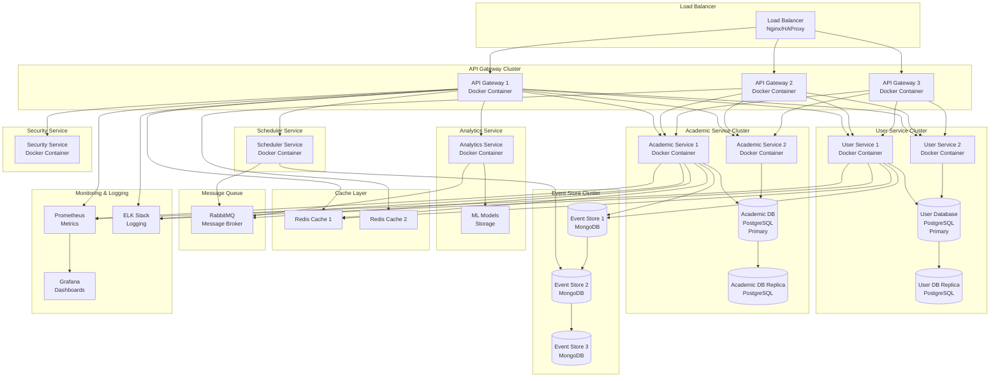
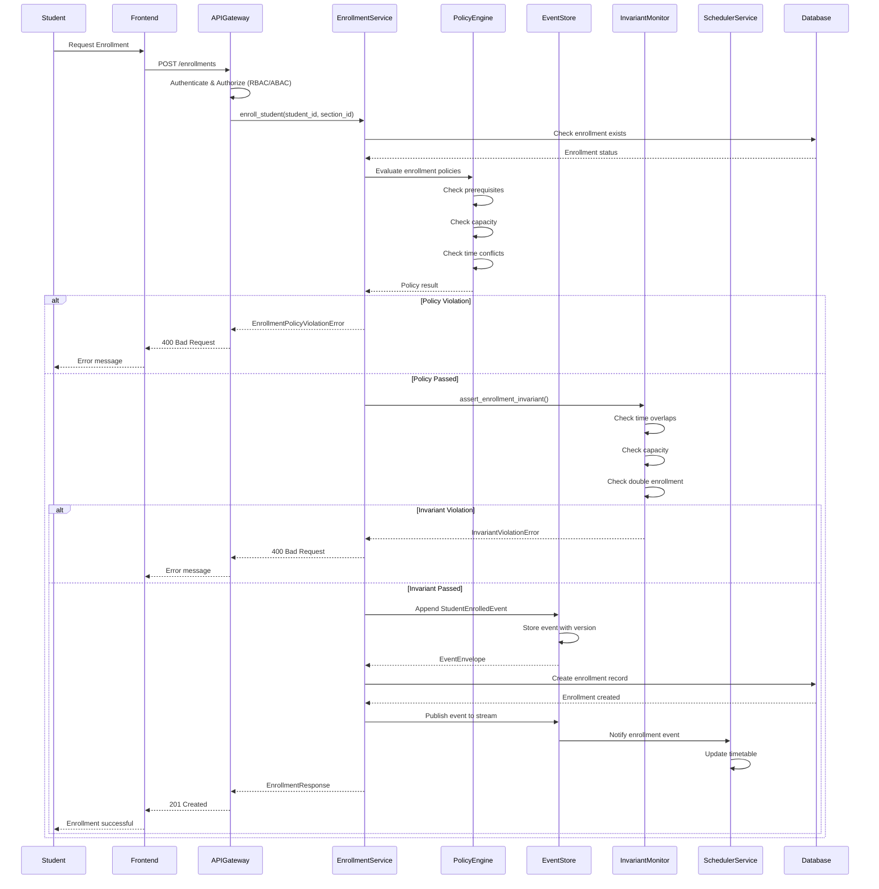
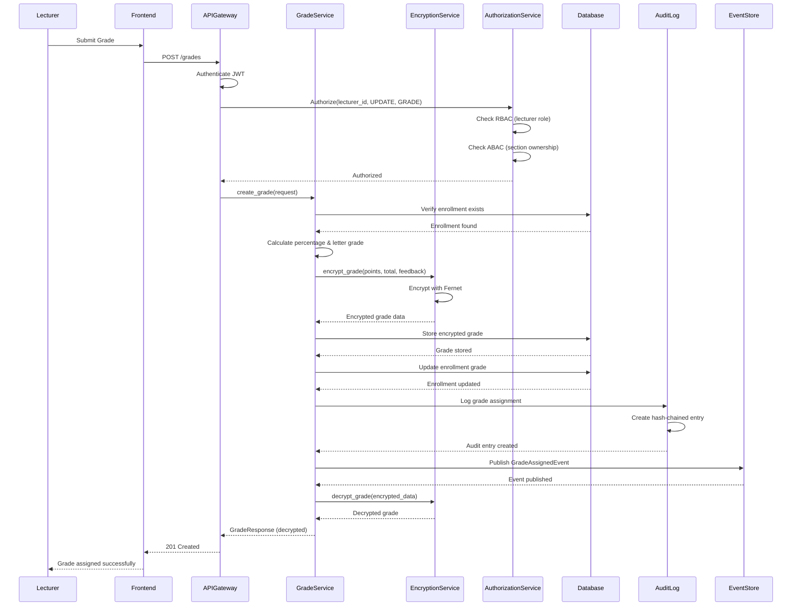
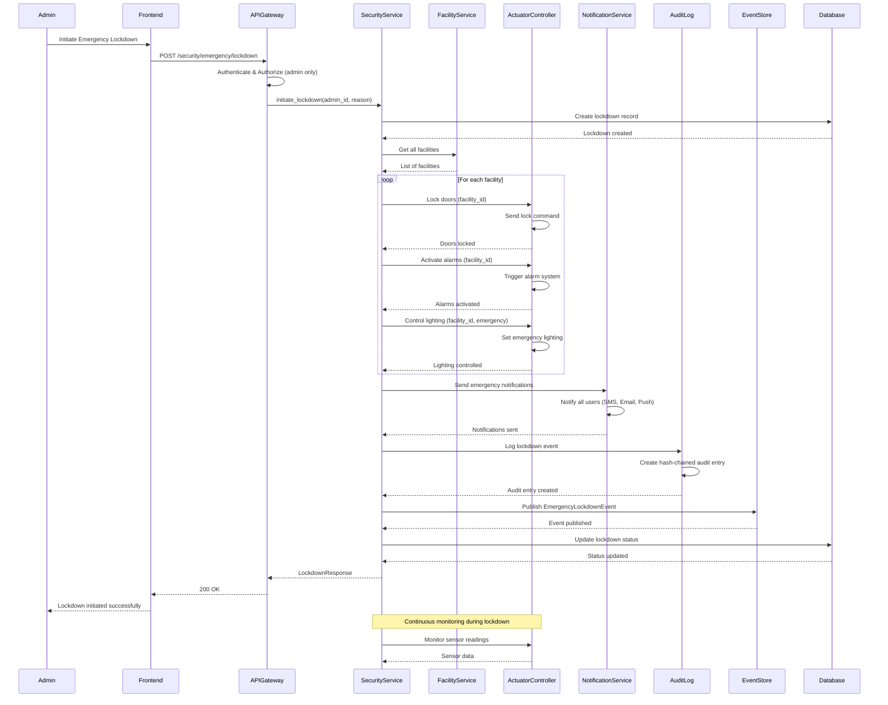

```mermaid
graph TB
    subgraph "Client Layer"
        WebApp[Web Application<br/>React/TypeScript]
        MobileApp[Mobile App<br/>Optional]
        SDK[Client SDK<br/>TypeScript/Python]
    end
    
    subgraph "API Gateway"
        Gateway[API Gateway<br/>FastAPI]
        Auth[Authentication<br/>JWT]
        RBAC[RBAC/ABAC<br/>Authorization]
        RateLimit[Rate Limiting]
        Versioning[API Versioning]
    end
    
    subgraph "User Service"
        UserAPI[User API<br/>FastAPI]
        UserDB[(User Database<br/>PostgreSQL)]
        UserAuth[Auth Service]
        UserModel[User Models]
    end
    
    subgraph "Academic Service"
        AcademicAPI[Academic API<br/>FastAPI]
        AcademicDB[(Academic DB<br/>PostgreSQL)]
        EnrollmentSvc[Enrollment Service]
        GradeSvc[Grade Service]
        CourseSvc[Course Service]
        Encryption[Encryption Service]
    end
    
    subgraph "Scheduler Service"
        SchedulerAPI[Scheduler API<br/>FastAPI]
        SchedulerSvc[Scheduler Service]
        ConstraintEngine[Constraint Engine]
        TimetableGen[Timetable Generator]
    end
    
    subgraph "Analytics Service"
        AnalyticsAPI[Analytics API<br/>FastAPI]
        MLService[ML Service]
        Predictor[Enrollment Predictor]
        Optimizer[Room Optimizer]
        ModelRegistry[Model Registry]
    end
    
    subgraph "Security Service"
        SecurityAPI[Security API<br/>FastAPI]
        GDPR[GDPR Service]
        AuditLog[Audit Log Service]
        PenTest[Penetration Tests]
    end
    
    subgraph "Shared Infrastructure"
        EventStore[(Event Store<br/>MongoDB)]
        EventStream[Event Stream<br/>Pub/Sub]
        CircuitBreaker[Circuit Breaker]
        LockManager[Lock Manager]
    end
    
    subgraph "External Services"
        EmailService[Email Service]
        NotificationSvc[Notification Service]
    end
    
    %% Client to Gateway
    WebApp --> Gateway
    MobileApp --> Gateway
    SDK --> Gateway
    
    %% Gateway to Services
    Gateway --> Auth
    Gateway --> RBAC
    Gateway --> RateLimit
    Gateway --> Versioning
    Gateway --> UserAPI
    Gateway --> AcademicAPI
    Gateway --> SchedulerAPI
    Gateway --> AnalyticsAPI
    Gateway --> SecurityAPI
    
    %% User Service
    UserAPI --> UserAuth
    UserAPI --> UserModel
    UserAPI --> UserDB
    
    %% Academic Service
    AcademicAPI --> EnrollmentSvc
    AcademicAPI --> GradeSvc
    AcademicAPI --> CourseSvc
    AcademicAPI --> Encryption
    AcademicAPI --> AcademicDB
    EnrollmentSvc --> EventStream
    GradeSvc --> Encryption
    
    %% Scheduler Service
    SchedulerAPI --> SchedulerSvc
    SchedulerSvc --> ConstraintEngine
    SchedulerSvc --> TimetableGen
    SchedulerSvc --> EventStream
    
    %% Analytics Service
    AnalyticsAPI --> MLService
    MLService --> Predictor
    MLService --> Optimizer
    MLService --> ModelRegistry
    MLService --> CircuitBreaker
    
    %% Security Service
    SecurityAPI --> GDPR
    SecurityAPI --> AuditLog
    SecurityAPI --> PenTest
    
    %% Shared Infrastructure
    EnrollmentSvc --> EventStore
    EventStream --> EventStore
    SchedulerSvc --> LockManager
    
    %% External Services
    Gateway --> EmailService
    Gateway --> NotificationSvc
```

# UML Diagrams for Smart Campus System

This document contains all UML diagrams in Mermaid format that can be pasted directly into Mermaid-compatible tools (GitHub, GitLab, Mermaid Live Editor, etc.).

---

## 1. Class Diagram (Detailed)

### Overview
The class diagram shows the complete object model with inheritance hierarchies, relationships, and key classes. It includes:
- 5+ levels of inheritance (AbstractEntity → VersionedEntity → AuditableEntity → Person → Student/Lecturer/Staff/Guest)
- Core domain classes (Course, Section, Enrollment, Grade, Assessment)
- Security classes (Credential, Role, Permission)
- Event sourcing classes (AggregateRoot, Event, EventStore)
- Scheduler subsystem (Constraint, Timetable)
- ML models (BaseMLModel, EnrollmentPredictor, RoomUsageOptimizer)

### Class Diagram

```mermaid
classDiagram
    %% Base Entity Hierarchy (5+ levels)
    class AbstractEntity {
        <<abstract>>
        +UUID id
        +datetime created_at
        +datetime updated_at
        +get_id() UUID
        +mark_updated() void
    }
    
    class VersionedEntity {
        <<abstract>>
        +int schema_version
        +dict metadata
        +increment_version() void
    }
    
    class AuditableEntity {
        <<abstract>>
        +UUID created_by
        +UUID updated_by
        +get_audit_summary() dict
    }
    
    class Person {
        <<abstract>>
        +str email
        +str first_name
        +str last_name
        +str middle_name
        +date date_of_birth
        +str phone_number
        +list attached_roles
        +bool is_pseudonymized
        +bool consent_given
        +pseudonymize() void
        +attach_role(str) void
        +has_role(str) bool
    }
    
    class Student {
        +UUID student_number
        +str major
        +str department
        +int year_level
        +float gpa
        +enroll(Section) Enrollment
    }
    
    class Lecturer {
        +str employee_id
        +str department
        +str title
        +list courses_taught
        +assign_grade(Student, Assessment, float) Grade
    }
    
    class Staff {
        +str employee_id
        +str department
        +str position
    }
    
    class Guest {
        +datetime access_expires_at
        +str sponsor_id
    }
    
    class Admin {
        +str admin_level
        +manage_users() void
    }
    
    %% Academic Domain
    class Course {
        +str course_code
        +str title
        +str description
        +int credits
        +str level
        +str department
        +list prerequisites
        +create_section() Section
    }
    
    class Section {
        +str section_number
        +str semester
        +UUID instructor_id
        +list schedule_days
        +time start_time
        +time end_time
        +int max_enrollment
        +int current_enrollment
        +bool is_full
        +enroll_student(Student) Enrollment
    }
    
    class Enrollment {
        +UUID student_id
        +UUID section_id
        +str enrollment_status
        +bool is_waitlisted
        +int waitlist_position
        +float current_grade_percentage
        +str current_letter_grade
        +datetime enrolled_at
    }
    
    class Assessment {
        +str assessment_type
        +str title
        +str description
        +datetime due_date
        +float total_points
        +bool is_available
        +check_availability() bool
    }
    
    class Grade {
        <<immutable>>
        +UUID student_id
        +UUID assessment_id
        +UUID section_id
        +float points_earned
        +float total_points
        +float percentage
        +str letter_grade
        +UUID graded_by
        +datetime graded_at
        +str feedback
        +int version
        +UUID previous_grade_id
        +create_regrade(float, UUID, str) Grade
    }
    
    class Syllabus {
        +str course_outline
        +list learning_objectives
        +dict grading_policy
        +list required_materials
    }
    
    %% Security Domain
    class Credential {
        <<abstract>>
        +UUID user_id
        +AuthStrategy strategy
        +datetime created_at
        +datetime last_used_at
        +verify(Any) bool
    }
    
    class PasswordCredential {
        +str password_hash
        +int failed_attempts
        +datetime locked_until
        +verify(str) bool
        +lock() void
    }
    
    class OAuthCredential {
        +str provider
        +str provider_user_id
        +str access_token
        +verify(Any) bool
    }
    
    class CertificateCredential {
        +str certificate_serial
        +str certificate_thumbprint
        +str issuer
        +datetime valid_from
        +datetime valid_until
        +verify(Any) bool
    }
    
    class Role {
        +str name
        +str description
        +list permissions
        +list inherits_from
        +bool is_system_role
        +int priority
        +has_permission(PermissionAction, ResourceType) bool
    }
    
    class Permission {
        <<immutable>>
        +PermissionAction action
        +ResourceType resource_type
        +UUID resource_id
        +dict conditions
        +matches(PermissionAction, ResourceType, UUID) bool
    }
    
    class AuthToken {
        +str token
        +UUID user_id
        +datetime expires_at
        +str token_type
        +bool is_valid() bool
    }
    
    %% Event Sourcing
    class AggregateRoot {
        <<abstract>>
        +UUID aggregate_id
        +int version
        +list uncommitted_events
        +apply_event(Event) void
        +mark_committed() void
    }
    
    class DomainEvent {
        <<abstract>>
        +UUID event_id
        +datetime occurred_at
        +str event_type
        +dict metadata
    }
    
    class EventStore {
        +append(Event, str, int) EventEnvelope
        +get_events(str, int, int) list
        +save_snapshot(UUID, dict, int) void
        +get_latest_snapshot(UUID) Snapshot
        +replay_aggregate(UUID, int) tuple
    }
    
    class EventEnvelope {
        +UUID event_id
        +str stream_id
        +int stream_version
        +Event event
        +datetime timestamp
    }
    
    %% Scheduler Subsystem
    class Constraint {
        <<abstract>>
        +str constraint_type
        +evaluate(Timetable) bool
        +get_violations(Timetable) list
    }
    
    class HardConstraint {
        +bool is_satisfied(Timetable) bool
    }
    
    class SoftConstraint {
        +float calculate_cost(Timetable) float
    }
    
    class CapacityConstraint {
        +int max_capacity
        +evaluate(Timetable) bool
    }
    
    class TimeConflictConstraint {
        +check_overlaps(Timetable) bool
    }
    
    class Timetable {
        +dict schedule
        +list constraints
        +generate() Timetable
        +create_snapshot() TimetableSnapshot
        +apply_constraints() bool
    }
    
    class TimetableSnapshot {
        +UUID snapshot_id
        +datetime captured_at
        +dict state
        +str hash
    }
    
    %% ML Models
    class BaseMLModel {
        <<abstract>>
        +str model_name
        +str version
        +train(dict) void
        +predict(dict) Any
        +explain(dict) dict
        +save(str) void
        +load(str) void
        +set_deterministic(int) void
    }
    
    class EnrollmentPredictor {
        +predict_dropout(UUID) float
        +train(dataset) void
        +explain(UUID) dict
    }
    
    class RoomUsageOptimizer {
        +optimize_room_allocation(dict) dict
        +train(env) void
        +explain(dict) dict
    }
    
    %% Facility Domain
    class Facility {
        +str name
        +str facility_type
        +str location
        +bool is_active
    }
    
    class Room {
        +str room_number
        +str building
        +int capacity
        +list amenities
        +bool is_bookable
    }
    
    class Resource {
        +str resource_type
        +str name
        +bool is_available
        +UUID assigned_to
    }
    
    class Sensor {
        +str sensor_type
        +str location
        +dict current_reading
        +datetime last_updated
    }
    
    class Actuator {
        +str actuator_type
        +str location
        +dict current_state
        +control(dict) void
    }
    
    %% Relationships
    AbstractEntity <|-- VersionedEntity
    VersionedEntity <|-- AuditableEntity
    AuditableEntity <|-- Person
    Person <|-- Student
    Person <|-- Lecturer
    Person <|-- Staff
    Person <|-- Guest
    Person <|-- Admin
    
    Person "1" --> "*" Credential : has
    Credential <|-- PasswordCredential
    Credential <|-- OAuthCredential
    Credential <|-- CertificateCredential
    
    Person "*" --> "*" Role : has
    Role "*" --> "*" Permission : contains
    
    Course "1" --> "*" Section : has
    Section "*" --> "*" Enrollment : contains
    Student "*" --> "*" Enrollment : has
    Section "*" --> "*" Assessment : has
    Student "*" --> "*" Grade : receives
    Assessment "1" --> "*" Grade : produces
    Course "1" --> "1" Syllabus : has
    
    EnrollmentAggregate --|> AggregateRoot
    EnrollmentAggregate "*" --> "*" DomainEvent : produces
    
    Timetable "*" --> "*" Constraint : uses
    Constraint <|-- HardConstraint
    Constraint <|-- SoftConstraint
    HardConstraint <|-- CapacityConstraint
    HardConstraint <|-- TimeConflictConstraint
    Timetable "1" --> "*" TimetableSnapshot : creates
    
    BaseMLModel <|-- EnrollmentPredictor
    BaseMLModel <|-- RoomUsageOptimizer
    
    Facility "1" --> "*" Room : contains
    Room "*" --> "*" Resource : has
    Resource <|-- Sensor
    Resource <|-- Actuator
```

---

## 2. Component Diagram

### Overview
The component diagram shows the microservices architecture, their interactions, and key components within each service.

### Diagram

---

## 3. Deployment Diagram

### Overview
The deployment diagram shows the physical deployment architecture, including containers, databases, and network topology.

### Diagram

---

## 4. Sequence Diagram - Enrollment Flow

### Overview
This sequence diagram shows the complete enrollment flow, including event sourcing, policy evaluation, and formal verification.

### Diagram

---

## 5. Sequence Diagram - Grade Assignment Flow

### Overview
This sequence diagram shows the grade assignment flow, including encryption, authorization, and audit logging.

### Diagram

---

## 6. Sequence Diagram - Emergency Lockdown Flow

### Overview
This sequence diagram shows the emergency lockdown flow, including facility control, notifications, and audit logging.

### Diagram

---
